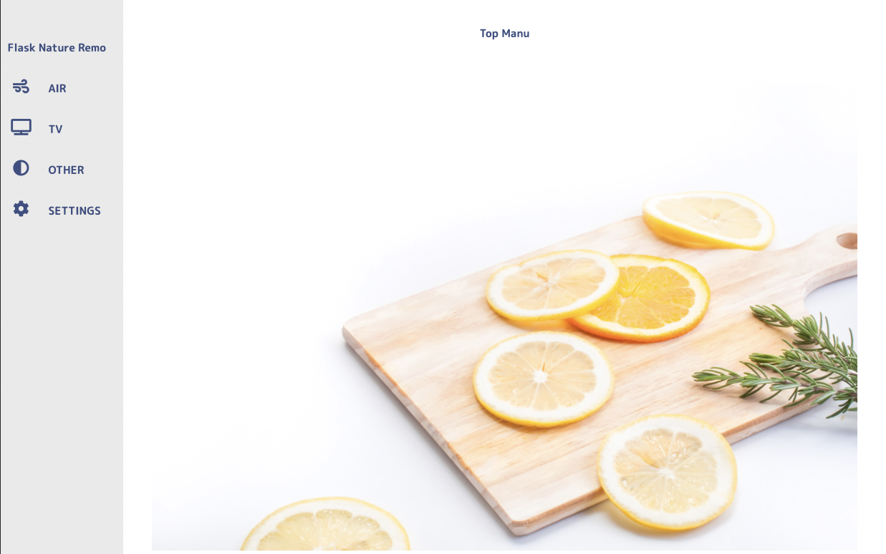
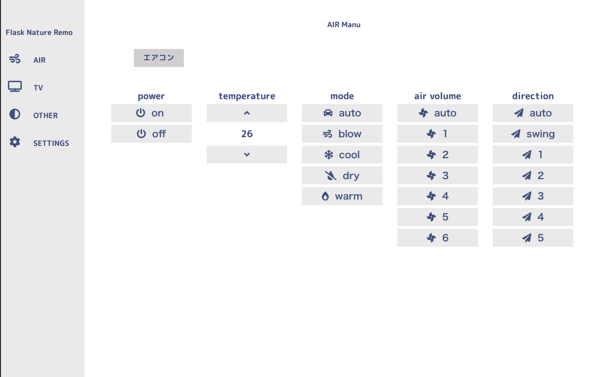
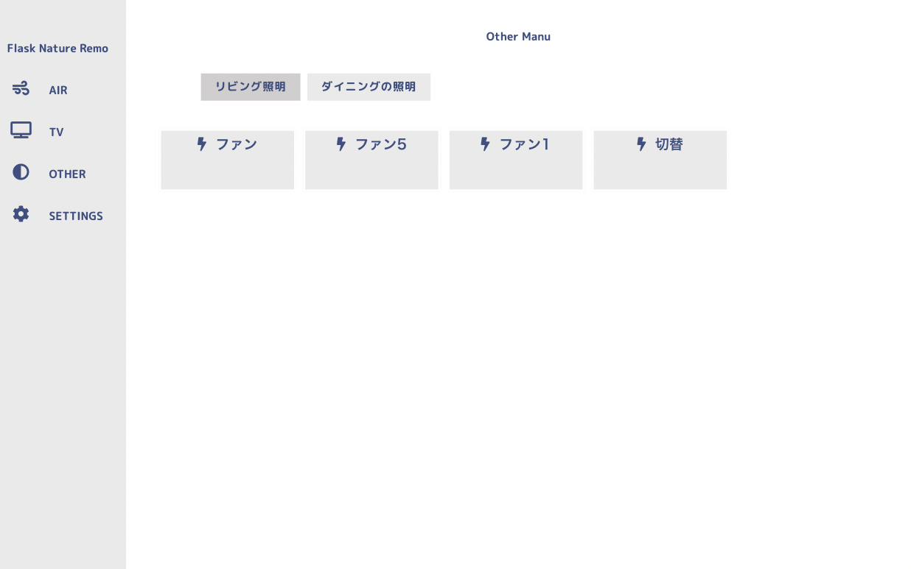
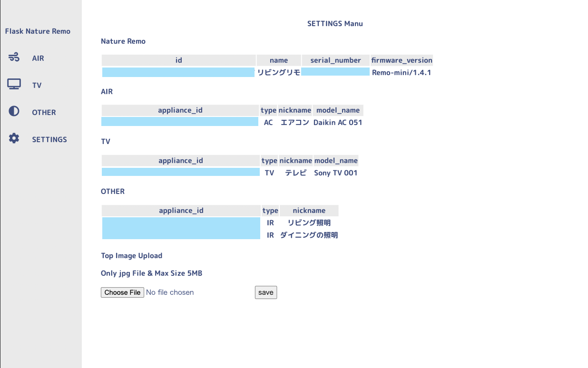

# Flask Nature Remo

Control Nature Remo Site<br>
Using Flask to control Nature Remo<br>
It is written in Python, base on flask.

# Demo

-   Save the api result as json the first time it is started.<br>
-   This minimizes the number of connections, because it only makes api connections at send time instead of every time.<br>







# Quick Start

Set your token to docker-compose.yml .<br>
You can create the api token with the official site.<br>

official site<br>
https://home.nature.global/home

docker-compose.yml

```yaml
version: "3"
services:
    web:
        build: .
        environment:
            - REMO_TOKEN=your_token
        ports:
            - 5000:5000
```

start container

```bash
$ docker-compose up -d
```

# Versions tested

-   Python 3.9
-   Flask 1.1
-   requests 2.25

# Installation

```bash
$ git clone https://github.com/n-guitar/flask-natuer-remo.git
$ python -m venv env
$ source ./env/bin/activate
$ pip install -r requirements.txt
```

# Usage

```bash
$ export REMO_TOKEN="your_token"
$ cd src
$ python main.py
```

# License

[MIT license](https://en.wikipedia.org/wiki/MIT_License).
